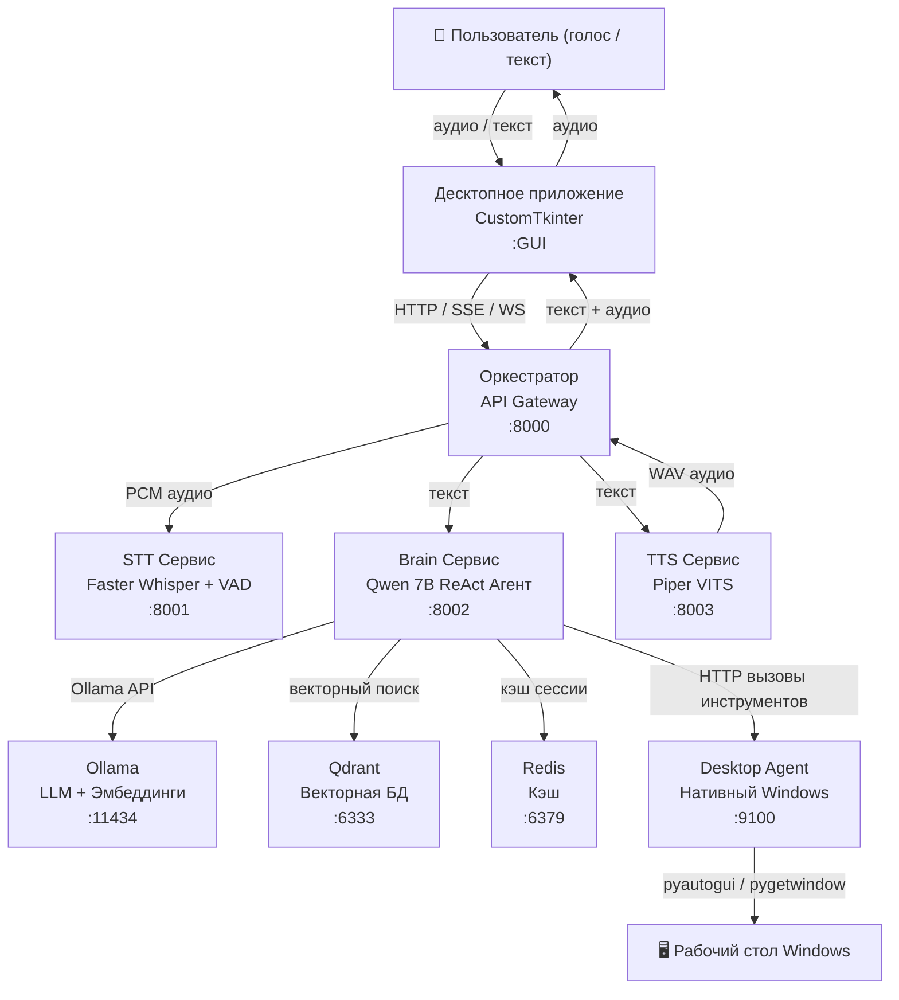

# Архитектура — LVCA

## Обзор

LVCA реализует **кибернетический цикл**: сенсорный ввод → центральная обработка → исполнительный вывод → обратная связь. Архитектура построена по паттерну микросервисов с API-шлюзом (Оркестратором), координирующим независимые сервисы.

---

## Общая схема



---

## Роли компонентов

### Оркестратор (:8000)

Центральный API-шлюз. Не запускает никаких ML-моделей — только маршрутизирует и проксирует запросы.

**Обязанности:**
- Принимает запросы от десктопного приложения (REST / SSE / WebSocket)
- Оркестрирует пайплайн STT → Brain → TTS
- Проксирует SSE-стриминг из Brain к клиенту
- Управляет WebSocket-сессиями (`ws_manager.py`)
- Предоставляет `/api/health` с агрегированным состоянием всех сервисов

**Ключевые файлы:**
```
orchestrator/
├── main.py        # FastAPI приложение, определения эндпоинтов
├── pipeline.py    # Логика оркестрации STT → Brain → TTS
└── ws_manager.py  # Управление WebSocket-сессиями
```

**Эндпоинты:**

| Метод | Путь | Описание |
|-------|------|----------|
| POST | `/api/chat` | Текстовый чат (REST, блокирующий) |
| GET | `/api/chat/stream` | Текстовый чат (SSE, стриминг) |
| POST | `/api/voice` | Полный голосовой пайплайн (WAV → JSON + WAV) |
| WS | `/ws/voice` | Полнодуплексный голосовой цикл (PCM ↔ JSON + аудио) |
| WS | `/ws/chat` | WebSocket текстовый чат |
| GET | `/api/health` | Агрегированная проверка состояния |

---

### STT Сервис (:8001)

Speech-to-Text. Конвертирует аудио в текст с помощью Faster Whisper и опционального Silero VAD.

**Обязанности:**
- Принимает WAV-аудио или PCM int16 поток
- Применяет VAD (определение речевой активности) для фильтрации тишины
- Нормализует и ресемплирует аудио (16кГц моно)
- Запускает инференс Faster Whisper (лучевой поиск, каскад температур)
- Возвращает транскрибированный текст с метаданными уверенности

**Ключевые файлы:**
```
services/stt/
├── engine.py        # Обёртка Faster Whisper, логика инференса
├── preprocessor.py  # Нормализация аудио, ресемплинг
├── vad.py           # Silero VAD (ONNX)
└── streaming.py     # FastAPI + WebSocket сервер
```

**Эндпоинты:**

| Метод | Путь | Описание |
|-------|------|----------|
| POST | `/api/transcribe` | WAV файл → транскрибированный текст |
| WS | `/ws/stt` | Стриминг: фрагменты PCM int16 → текст |
| GET | `/health` | Проверка состояния |

---

### Brain Сервис (:8002)

LLM-агент. Центральный компонент рассуждений — понимает запросы, принимает решения о действиях, выполняет инструменты, генерирует ответы.

**Обязанности:**
- Поддерживает память разговора (скользящее окно)
- Извлекает RAG-контекст из Qdrant перед каждым запросом
- Запускает ReAct цикл (до 8 итераций):
  1. Наблюдение: формирует промпт (системный + RAG + история + ввод пользователя)
  2. Рассуждение: LLM генерирует текст рассуждения и опциональный вызов инструмента
  3. Действие: выполняет инструмент, добавляет результат обратно в контекст
  4. Повторяет или возвращает финальный ответ
- Стримит токены через SSE
- Индексирует документы в Qdrant

**Ключевые файлы:**
```
services/brain/
├── agent.py         # ReAct цикл, стриминг, диспетчеризация инструментов
├── ollama_client.py # Асинхронный HTTP-клиент для Ollama API
├── memory.py        # Буфер разговора (скользящее окно)
├── prompts.py       # Системный промпт, шаблоны RAG-инъекции
├── embeddings.py    # Обёртка Ollama Embeddings API
├── vectorstore.py   # Обёртка клиента Qdrant
├── retriever.py     # Плотный поиск (top-k, косинусное сходство)
├── indexing.py      # Пайплайн индексации документов
├── chunking.py      # Разбиение текста с учётом Markdown
├── interfaces.py    # Абстрактные базовые классы
├── streaming.py     # FastAPI + SSE эндпоинты
└── tools/           # 25 реализаций инструментов
```

**Эндпоинты:**

| Метод | Путь | Описание |
|-------|------|----------|
| POST | `/api/chat` | Одиночный запрос-ответ |
| GET | `/api/chat/stream` | SSE-стриминг токен за токеном |
| POST | `/api/index` | Индексация документа в RAG |
| GET | `/health` | Проверка состояния |

---

### TTS Сервис (:8003)

Text-to-Speech. Конвертирует текст в WAV-аудио.

**Обязанности:**
- Принимает текстовый ввод
- Синтезирует речь с помощью Piper VITS (CPU, по умолчанию) или XTTS-v2 (GPU, опционально)
- Возвращает WAV-байты (22050 Гц)

**Ключевые файлы:**
```
services/tts/
├── engine.py          # Движки Piper и XTTS-v2
├── voice_cloning.py   # Управление голосовыми образцами
└── streaming.py       # FastAPI сервер
```

**Эндпоинты:**

| Метод | Путь | Описание |
|-------|------|----------|
| POST | `/api/synthesize` | Текст → WAV аудио байты |
| GET | `/health` | Проверка состояния |

---

### Desktop Agent (:9100) — Нативный Windows-процесс

Запускается **вне Docker** как нативный Windows-процесс. Необходим потому, что pyautogui и pygetwindow требуют доступа к активной GUI-сессии.

**Обязанности:**
- Предоставляет HTTP API на `127.0.0.1:9100` (только localhost)
- Получает вызовы инструментов от Brain через `host.docker.internal`
- Выполняет действия по автоматизации рабочего стола
- Классифицирует действия по уровню опасности перед выполнением

**Модель безопасности:**
```
safe      → выполняется напрямую
moderate  → выполняется с логированием
dangerous → заблокировано (форматирование, выключение, удаление системных файлов)
```

Защищённые системные процессы: `csrss`, `lsass`, `explorer`, `svchost`, `winlogon`

Аварийный стоп pyautogui: переместить мышь в угол экрана = экстренная остановка

**Ключевые файлы:**
```
desktop_agent/
├── main.py      # FastAPI приложение, :9100
├── config.py    # Реестр приложений, настройки безопасности
├── safety.py    # Классификатор действий
└── routes/
    ├── apps.py        # Запуск/закрытие приложений
    ├── windows.py     # Управление окнами
    ├── input.py       # Клавиатура/мышь
    ├── screenshot.py  # Снимок экрана
    ├── clipboard.py   # Буфер обмена
    ├── media.py       # Громкость + медиаклавиши
    ├── process.py     # Управление процессами
    ├── system_info.py # Статистика CPU/RAM/GPU
    └── notify.py      # Системные уведомления
```

---

### Десктопное приложение — GUI-клиент

Интерфейс на CustomTkinter с тёмной темой для голосового и текстового взаимодействия.

```
app/
├── main.py             # Главное окно
├── ui/
│   ├── chat_frame.py   # Отображение чата + потоковый рендеринг
│   ├── voice_frame.py  # Кнопка push-to-talk + состояние записи
│   └── status_bar.py   # Индикаторы состояния сервисов
├── audio/
│   ├── capture.py      # Запись с микрофона PyAudio (PCM 16кГц)
│   └── playback.py     # Воспроизведение аудио sounddevice
└── client/
    ├── api.py          # REST-клиент (httpx)
    ├── stream.py       # SSE-клиент + парсер событий
    └── ws.py           # WebSocket-клиент
```

Деградация: SSE → REST-резервный вариант при недоступности стриминга.

---

## Потоки данных

### Текстовый чат

```
Пользователь вводит текст → Приложение
  │
  ├─ SSE: GET /api/chat/stream?text=...
  │         │
  │    Оркестратор → Brain /api/chat/stream
  │                      │
  │                   RAG-извлечение (Qdrant)
  │                      │
  │                   Qwen 7B генерирует токены
  │                      │
  │              data: {"type":"token","text":"..."}
  │              data: {"type":"done","full_text":"..."}
  │
  └─ Приложение рендерит текст в режиме стриминга
```

### Голосовой чат

```
Пользователь говорит → PyAudio записывает PCM (16кГц моно int16)
  │
  ├─ Приложение отправляет WAV на POST /api/voice
  │         │
  │    Оркестратор
  │         ├─ POST /api/transcribe → STT (Whisper)
  │         │   Возвращает: {"text": "Открой Chrome"}
  │         │
  │         ├─ GET /api/chat/stream → Brain
  │         │   ReAct цикл:
  │         │     Шаг 1: LLM → {"tool": "app_launch", "args": {"app": "chrome"}}
  │         │     Шаг 2: Desktop Agent POST /api/apps/launch {"name": "chrome"}
  │         │             pyautogui → chrome.exe запущен
  │         │     Шаг 3: LLM → "Chrome открыт"
  │         │
  │         └─ POST /api/synthesize → TTS (Piper)
  │             Возвращает: WAV байты (22050 Гц)
  │
  └─ Приложение воспроизводит аудио-ответ
```

### RAG-запрос

```
Пользователь: "Какие у тебя есть инструменты?"
  │
Brain Сервис:
  1. Эмбеддинг запроса: nomic-embed-text (768-мерный вектор)
  2. Косинусный поиск в Qdrant: top-6 чанков, score > 0.5
  3. Извлечённый контекст:
       "LVCA имеет 25 инструментов: app_launch, file_read, browser..."
  4. Формирование промпта:
       [системный промпт]
       [RAG контекст]
       [история разговора]
       Пользователь: "Какие у тебя есть инструменты?"
  5. Qwen 7B генерирует ответ на основе контекста
  6. Стриминг токенов → клиент
```

---

## Карта портов

| Сервис | Порт | Протокол | Запускается в |
|--------|------|----------|---------------|
| Оркестратор | 8000 | HTTP / SSE / WS | Docker |
| STT | 8001 | HTTP / WS | Docker (GPU) |
| Brain | 8002 | HTTP / SSE | Docker |
| TTS | 8003 | HTTP | Docker (CPU/GPU) |
| Desktop Agent | 9100 | HTTP | Нативный Windows |
| Ollama | 11434 | HTTP | Docker (GPU) |
| Qdrant | 6333 | HTTP / gRPC | Docker |
| Redis | 6379 | Redis | Docker |
| Prometheus | 9090 | HTTP | Docker |
| Grafana | 3000 | HTTP | Docker |

---

## Паттерны проектирования

### ReAct Цикл агента

```
Итерация 1..8:
  НАБЛЮДЕНИЕ  → системный промпт + RAG контекст + история + ввод пользователя
  РАССУЖДЕНИЕ → LLM генерирует текст рассуждения
  ДЕЙСТВИЕ    → если обнаружен вызов инструмента: выполнить, добавить результат
  ПОВТОРЕНИЕ  → если не достигнут лимит итераций и нет финального ответа

ФИНАЛ        → LLM генерирует финальный ответ (без вызова инструмента)
```

Обнаружение вызова инструмента: парсинг JSON из вывода LLM.

### Пайплайн стриминга

```
Brain (Ollama стриминг) → SSE токены
  └─ Оркестратор проксирует SSE → клиент

Каждое SSE-событие:
  {"type": "token",  "text": "слово"}          ← частичный токен
  {"type": "tool",   "tool": "...", "result": "..."} ← выполнение инструмента
  {"type": "done",   "full_text": "..."}        ← стриминг завершён
  {"type": "error",  "message": "..."}          ← ошибка
```

### Плагинная система инструментов

```python
class BaseTool(ABC):
    name: str
    description: str  # отображается LLM в системном промпте

    @abstractmethod
    async def execute(self, **kwargs) -> ToolResult: ...

# Регистрация:
agent.register_tool(MyTool())
```

Десктопные инструменты — это тонкие HTTP-прокси к Desktop Agent, что позволяет Brain работать в контейнере, а Desktop Agent — нативно.

---

## Режимы развёртывания

### Docker Compose (разработка)

```bash
make up        # только CPU
make up-gpu    # с NVIDIA GPU
```

Все сервисы в контейнерах, кроме Desktop Agent (запускается нативно).

### Нативный Python (без Docker)

```bash
make native-up
```

STT / Brain / TTS запускаются как нативные Python-процессы. Удобно для разработки или когда Docker недоступен.

### Kubernetes / Helm (продакшн)

Три профиля значений:

| Профиль | Файл | Сценарий использования |
|---------|------|------------------------|
| Продакшн | `values.yaml` | Полный GPU-кластер |
| Разработка | `values-dev.yaml` | CPU, сниженные ресурсы |
| Гибридный | `values-hybrid.yaml` | Ollama/Qdrant/Redis на хосте, сервисы в K8s |

```bash
helm install lvca infra/helm/lvca/ -f infra/helm/lvca/values.yaml
```
